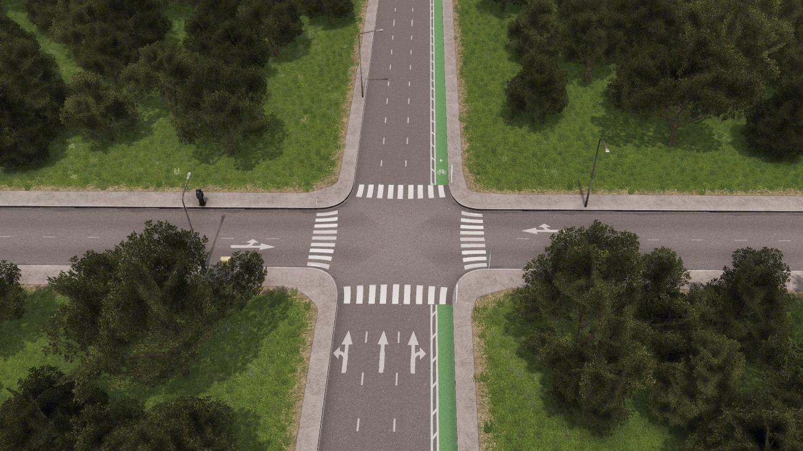
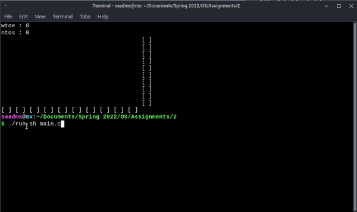

# road-intersection-problem

Fast Nuces selects a student to solve teen talwar traffic intersection problem.The details of problem are as follows: in two one-way roads as shown below, traffic is trying to pass through this intersection of roads, such as east to west and north to south without any collision, the intersection road is origin point for cars. Cars have to exit in the opposite direction, therefore cars need to pass through intersections. In this problem, cars are not allowed to take turns. Inside an intersection, more than one vehicle can get in and given that a car&#39;s path will not create a collision. Due to some construction problems in this area, a maximum of three cars can get inside the intersection at the same time. Create a program with proper synchronization as per provided scenario.



## Authors

- github : [@saad0510](https://www.github.com/saad0510)
- email : ayyansaad46@gmail.com or k200161@nu.edu.pk


## Run Locally

Clone the project

```bash
  git clone https://github.com/saad0510/road-intersection-problem
```

Go to the project directory

```bash
  cd road-intersection-problem
```

Compile the program

```bash
  gcc main.c -o main.out -lpthread
```

Start the program

```bash
  ./main.out
```

> The project is only compiled for unix based systems

## Screenshots


